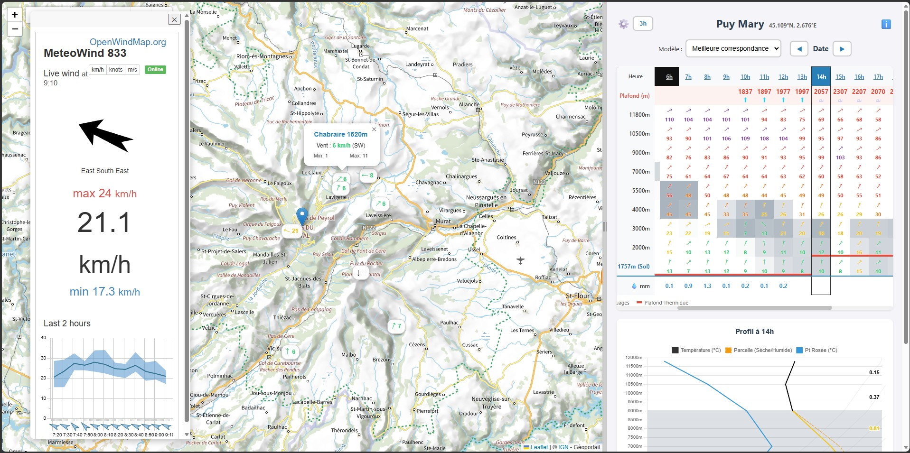
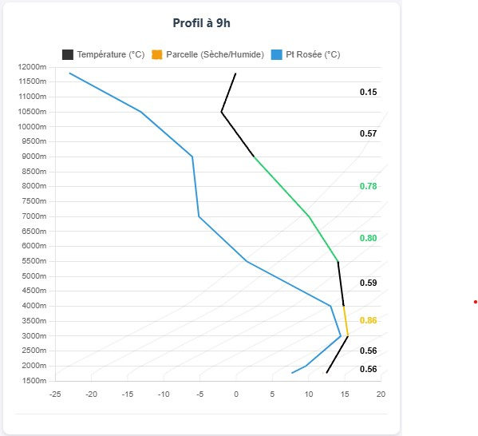
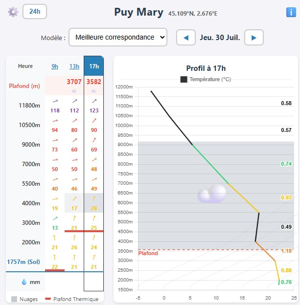
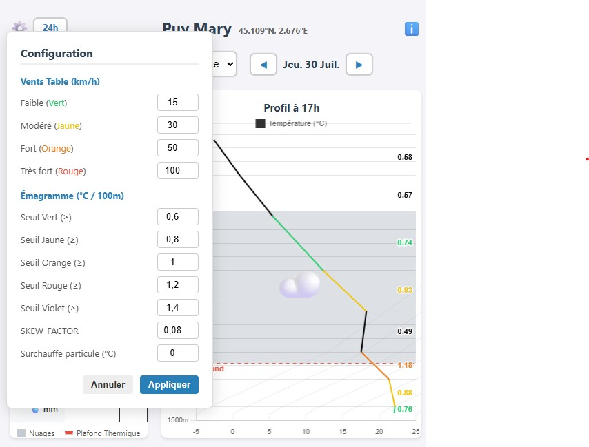
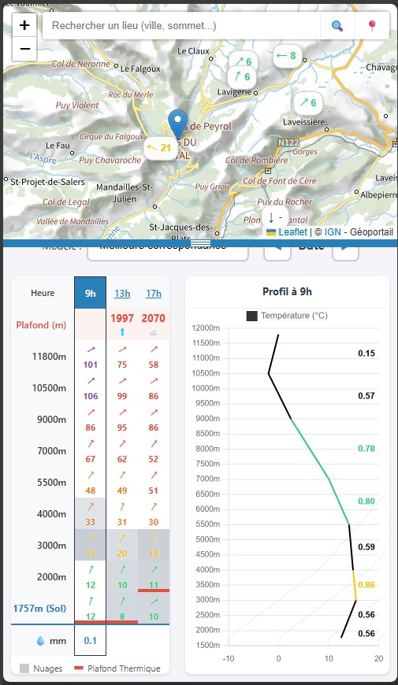

# 🌤️ Ma Météo

Faire sa météo rapidement avant d'aller voller.

Explorez les conditions atmosphériques facilement.

[Application web](https://01ive.github.io/maMeteo/)

## 🎯 Pourquoi faire?

Comprendre la météo, c'est bien plus que regarder un thermomètre ! Cette application vous permet de :
- 🗺️ Visualiser les conditions météorologiques sur une carte interactive
- 📊 Analyser les profils verticaux de l'atmosphère
- 💨 Interpréter les vitesses et directions du vent avec un code couleur intuitif
- ☁️ Comprendre la formation des nuages et les phénomènes thermiques
- 🎓 Accéder à des explications scientifiques détaillées et visualisations avancées

Parfait pour les amateurs de météo, les pilotes, les parapentistes et tous ceux qui veulent vraiment comprendre le ciel au-dessus de leur tête !

## 🚀 Utilisation

1. Ouvrez l'application dans votre navigateur
2. Naviguez sur la carte pour explorer différentes régions
3. Consultez les données météorologiques affichées en temps réel
4. Utilisez l'émagramme pour analyser les profils atmosphériques
5. Explorez les explications détaillées pour comprendre chaque concept

## Screenshots

### PC

### Mobile

## 📋 Les éléments

### 🗺️ La carte

La carte interactive vous permet de visualiser les conditions météorologiques à différents endroits.

### 🎛️ Sélection des informations

Personnalisez l'affichage des données selon vos besoins et préférences.

### 💨 La table des vents

#### 🎨 Code couleur du vent

- 🟢 **Vert** < 15 km/h — Calme, peu de vent
- 🟡 **Jaune** < 30 km/h — Vent faible à modéré
- 🟠 **Orange** < 50 km/h — Vent modéré à soutenu
- 🔴 **Rouge** < 100 km/h — Vent soutenu à fort
- 🟣 **Violet** ≥ 100 km/h — Vent très violent

#### ☁️ Nébulosité

Dans l’interface, la couverture nuageuse affichée n’est pas une valeur brute de l’API. Elle est dérivée de l’humidité relative calculée à partir de la température et du point de rosée :

$$e(T) = 6.112 \times e^{17.67T / (T + 243.5)}$$

$$RH = \frac{e(T_d)}{e(T)} \times 100$$

Ensuite, l’application applique un proxy visuel de couverture nuageuse :

- si $RH < 80\%$, la valeur est fixée à $0$ ;
- si $RH \ge 80\%$, elle devient :

$$C_{nuage} = \min\left(100,\,(RH - 80) \times 5\right)$$

Cette valeur sert à l’opacité des cellules de la grille et à la teinte de la zone nuageuse dans l’émagramme. Elle ne représente pas une couverture nuageuse météorologique absolue, mais un indicateur visuel de humidité et de probabilité de présence de nuages.

#### 📈 Instabilité

Pour modéliser le plafond thermique, l’application simule l’ascension d’une parcelle d’air depuis la surface avec un offset configurable :

$$T_{parcel,0} = T_{base} + \text{parcelOffset}$$

Par défaut, $	ext{parcelOffset} = 0^\circ\text{C}$, mais il peut être modifié dans la configuration.

À chaque pas de $20\text{m}$, la parcelle évolue selon deux régimes :

- hors nuage : gradient adiabatique sec :
  $$\Gamma_{sec} = -0.0098^\circ\text{C/m}$$
- si la parcelle a atteint la base de nuage estimée par :
  $$z_{cloudBase} = z_{base} + \max\left(0,\,(T_{base} - T_{d,base}) \times 125\right)$$
  alors le calcul bascule sur un gradient pseudo-adiabatique humide, avec :
  $$T_k = T_{parcel} + 273.15$$
  $$e_s = 6.112 \times e^{17.67T_{parcel}/(T_{parcel} + 243.5)}$$
  $$w_s = \frac{0.622 \times e_s}{P - e_s}$$
  $$L = 2501000 - 2370T_{parcel}$$
  $$\Gamma_{hum} = -\frac{9.80665}{1004} \times \frac{1 + \frac{Lw_s}{287.05T_k}}{1 + \frac{0.622L^2w_s}{1004 \times 287.05 \times T_k^2}}$$

Après chaque incrément, l’application applique un entraînement de $1\%$ à chaque pas de $20\text{m}$ :

$$T_{parcel,new} = T_{parcel} \times 0.99 + T_{env} \times 0.01$$

La parcelle cesse de monter dès que $T_{parcel} \le T_{env}$. Le plafond affiché est alors défini comme suit :

- dans la grille, le plafond est la hauteur atteinte par la parcelle, puis il est ramené à la base du nuage si la parcelle est entrée dans la zone nuageuse :
  $$\text{exactAlt} = \max\left(z_{cloudBase}, z_{base}\right) \quad \text{si } \text{exactAlt} > z_{cloudBase}$$
- dans l’émagramme, la ligne de plafond exploitable correspond à :
  $$\text{plafondAlt} = \min\left(z_{top}, z_{cloudBase}\right)$$

Cette logique permet d’afficher un plafond “exploitable” et de bloquer le trait rouge si le thermique entre dans la zone nuageuse.

### 📊 L’émagramme

Le diagramme thermodynamique a été enrichi pour rendre plus lisibles les zones instables, la base des nuages et le plafond exploitable. L’émagramme affiche maintenant :

- une courbe de température de l’environnement,
- une parcelle d’air ascendante,
- un point de rosée,
- une zone grisée pour représenter la couche nuageuse,
- une ligne rouge de plafond thermique.

### 🌈 Coloration de l’émagramme

La coloration de l’émagramme suit le gradient thermique local entre deux niveaux de l’atmosphère, calculé en °C / 100 m selon la formule :

$$\text{lapseRate} = \frac{T_{env}(z_0) - T_{env}(z_1)}{z_1 - z_0} \times 100$$

Dans le code, les seuils par défaut sont ceux définis dans la configuration de l’application :

- **lapse1 = 0.6** : seuil de transition vers le vert
- **lapse2 = 0.8** : seuil de transition vers le jaune
- **lapse3 = 1.0** : seuil de transition vers l’orange
- **lapse4 = 1.2** : seuil de transition vers le rouge
- **lapse5 = 1.4** : seuil de transition vers le violet

La correspondance utilisée est donc :

* 🟣 **Violet** ($\ge 1.4$ °C/100m) : très forte instabilité, très proche de l’adiabatique sèche.
* 🔴 **Rouge** ($\ge 1.2$ °C/100m) : forte instabilité.
* 🟠 **Orange** ($\ge 1.0$ °C/100m) : instabilité marquée.
* 🟡 **Jaune** ($\ge 0.8$ °C/100m) : instabilité modérée.
* 🟢 **Vert** ($\ge 0.6$ °C/100m) : couche plutôt stable.
* ⬛ **Noir** (< 0.6 °C/100m) : stabilité forte, isothermie ou inversion de température.

Cette logique est utilisée pour colorer la courbe de température de l’environnement et rendre immédiatement visibles les couches qui favorisent ou bloquent la convection.

#### 📐 Skew-T (Diagramme incliné)

Dans les représentations météorologiques classiques, on incline les lignes de température vers la droite pour compenser la baisse naturelle de température avec l’altitude. L’objectif est d’obtenir une masse d’air standard quasi verticale, ce qui rend beaucoup plus visibles les anomalies et les zones d’instabilité.

Pour reproduire cet effet dans Chart.js, l’application applique à chaque point une déformation X proportionnelle à la chute de pression entre le bas du graphique et le niveau considéré :

$$T_{skew} = T_{reel} + k \times \left(p_{bottom} - p\right)$$

- $T_{skew}$ : la température fictive utilisée pour le tracé.
- $T_{reel}$ : la température réelle de l’air.
- $k$ : le facteur SKEW_FACTOR.
- $p_{bottom}$ : la pression au bas du graphique, calculée à partir de la base visible de la fenêtre :
  $$p_{bottom} = \text{getEnvAtZ}(z_{bottom}).hpa$$
  avec
  $$z_{bottom} = \left\lfloor \frac{\text{elevation}}{500} \right\rfloor \times 500$$
- $p$ : la pression du niveau considéré.

Dans l’implémentation actuelle, $p_{bottom}$ n’est donc pas figé à 1000 hPa, mais défini à partir de la zone réellement affichée dans l’émagramme, ce qui rend le décalage cohérent avec la plage d’altitude visible.

##### 💡 Pourquoi exactement 0.08 ?

Le choix de 0.08 reste un bon compromis visuel pour la taille de la fenêtre web et la plage d’altitude affichée. Avec un écart de pression d’environ 800 hPa entre le sol et 11 800 m, le décalage appliqué est de :

$$800 \times 0.08 = 64$$

Ce qui place la courbe de température au centre du graphe et lui donne l’angle caractéristique d’un vrai diagramme Skew-T.

---

## 💡 Caractéristiques principales

✨ **Interface intuitive** — Facile à prendre en main  
🎯 **Données précises** — Modèles météorologiques fiables  
📱 **Responsive** — Fonctionne sur tous les appareils  
⚡ **Performance** — Chargement rapide et fluide  
🔍 **Détails avancés** — Pour les passionnés de météo

---

**Amusez-vous à explorer l'atmosphère ! 🌈 Envole-toi ! ✈️**

## 📜 Licences

Ce projet s'appuie sur d'excellentes bibliothèques et services open-source. Voici les licences correspondantes :

| Bibliothèque | Licence | Description |
|---|---|---|
| **[Open-Meteo](https://open-meteo.com/)** | [CC BY 4.0](https://creativecommons.org/licenses/by/4.0/) | API météorologiques gratuites et open-source |
| **[Leaflet](https://leafletjs.com/)** | [BSD 2-Clause](https://github.com/Leaflet/Leaflet/blob/main/LICENSE) | Bibliothèque JavaScript pour cartes interactives |
| **[Chart.js](https://www.chartjs.org/)** | [MIT](https://github.com/chartjs/Chart.js/blob/master/LICENSE.md) | Bibliothèque de graphiques JavaScript |
| **[OpenStreetMap](https://www.openstreetmap.org/)** | [ODbL](https://opendatacommons.org/licenses/odbl/) | Données cartographiques libres |

### 📖 Conditions d'utilisation

- ✅ Vous êtes libre d'utiliser, modifier et distribuer ce projet confiramant à sa licence (fichier **LICENSE**)
- 📝 Veuillez respecter les termes de chaque licence
- 🔗 Mentionnez les sources et contributeurs (attribution requise)
- 🌍 Partagez vos améliorations avec la communauté

Merci à tous ! 🙏

**01ive** 🪂